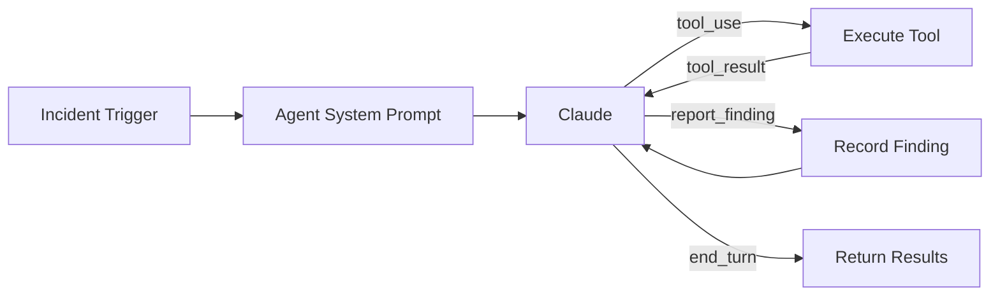

# Agent Architecture

Traced uses a multi-agent architecture where specialist agents investigate different aspects of an incident in parallel. Each agent runs an independent Claude tool-calling loop.

## Agent Types

### Observability Agent

Investigates metrics and logs from your observability stack.

**Tools:**

| Tool | Backend | What it does |
|------|---------|-------------|
| `query_prometheus` | Prometheus | Execute PromQL queries — error rates, latency percentiles, resource usage |
| `search_logs` | Elasticsearch | Search application logs with KQL/Lucene — errors, exceptions, anomalies |
| `query_cloudwatch` | CloudWatch | Query AWS metrics — Lambda errors, RDS connections, ELB health |

**Investigation strategy:** Start with the reported symptom, check error rates and latency, search logs for exceptions, look for resource saturation.

### Kubernetes Agent

Inspects cluster state to find pod failures, resource issues, and scheduling problems.

**Tools:**

| Tool | What it does |
|------|-------------|
| `get_pods` | List pods with status, restart counts, resource usage |
| `describe_pod` | Detailed pod info including events and container statuses |
| `get_events` | Recent K8s events — OOM kills, probe failures, scheduling issues |
| `describe_deployment` | Deployment details — replicas, strategy, rollout status |
| `get_node_status` | Node health — conditions, allocatable resources |
| `get_logs` | Container logs from pods (including previous crashed containers) |

**Investigation strategy:** Check pods for crashes/restarts, review events, inspect deployments, check node pressure.

### Change Detection Agent

Looks for recent changes that might have caused the incident.

**Tools:**

| Tool | What it does |
|------|-------------|
| `get_recent_deployments` | Recent deployments with revision, image, and rollout status |
| `get_configmap_changes` | ConfigMap changes (filters out system ConfigMaps) |

**Investigation strategy:** Check for deployments correlating with incident onset, look for config changes.

## How Agents Work

Each agent follows the same pattern:

1. Receives the incident trigger with context
2. Gets a system prompt with its role + runbook guidance (if a runbook matched)
3. Enters a Claude tool-calling loop (max 10 iterations)
4. Claude decides which tools to call based on the incident
5. Tool results are fed back to Claude for analysis
6. Claude calls `report_finding` for each significant discovery
7. Returns structured findings with severity and evidence

## Orchestrator

The Orchestrator is not an agent — it manages agents:

1. Matches a runbook to the incident
2. Injects runbook guidance into each agent's prompt
3. Runs all agents in parallel with timeout
4. Collects findings from all agents
5. Sends combined findings to Claude for root cause synthesis
6. Claude calls `report_root_cause` and `suggest_action` tools
7. Returns the complete investigation result

## Adding a New Agent

To add a custom specialist agent:

1. Create a class extending `BaseAgent` in `src/traced_cloud/agents/`
2. Define `name`, `description`, `get_system_prompt()`, `get_tools()`, and `execute_tool()`
3. Register it in `Orchestrator._register_agents()`
4. Add corresponding API endpoints in the Collector if the agent needs new data sources
