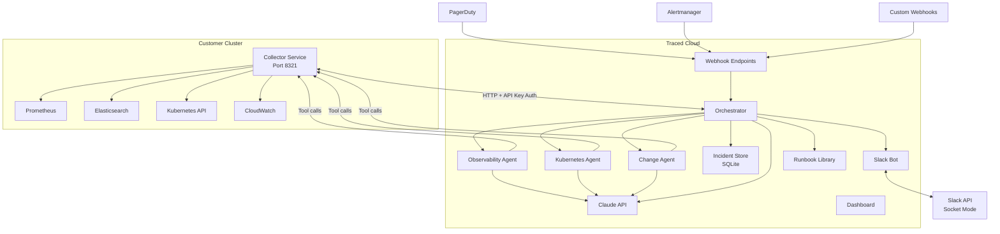
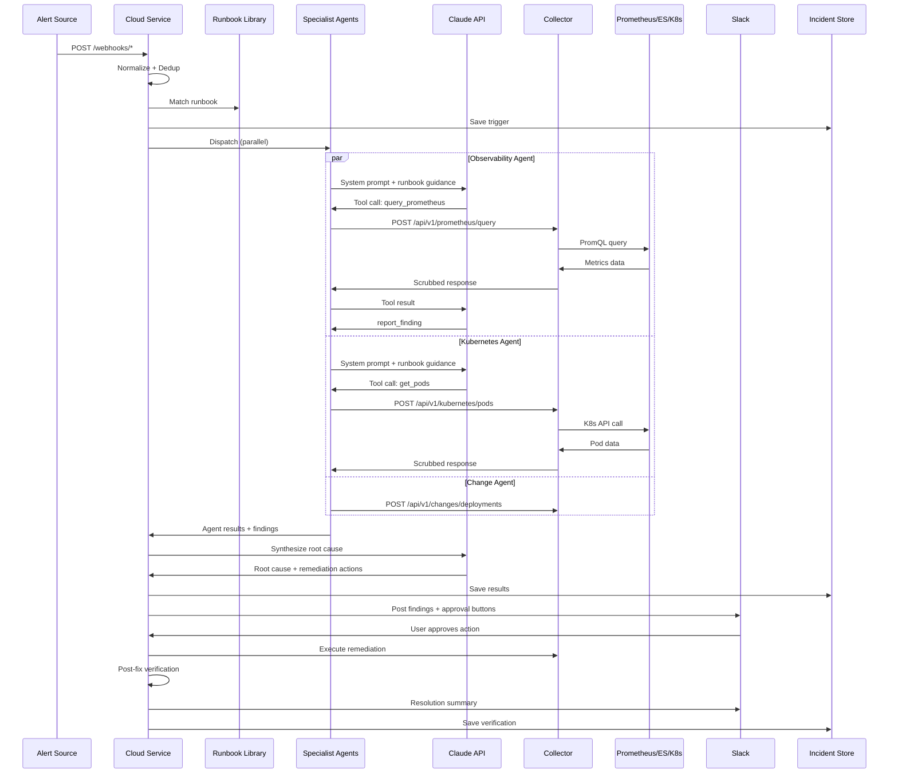

# Architecture Overview

Traced uses a split architecture with two services: the **Collector** runs inside the customer's cluster, and the **Cloud** service runs the AI orchestration.

## System Architecture

## Data Flow

### Investigation Lifecycle

## Component Details

### Collector Service

The Collector runs in the customer's cluster and acts as a secure proxy. It:

- Queries Prometheus, Elasticsearch, Kubernetes API, and CloudWatch
- Scrubs sensitive data (emails, IPs, credentials, tokens) before sending responses
- Authenticates requests via API key (constant-time comparison)
- Exposes remediation action endpoints (restart pod, rollback, scale)

The Collector never initiates outbound connections to the Cloud service — it only responds to requests.

### Cloud Service

The Cloud service is the brain. It:

- Receives alerts via webhooks (PagerDuty, Alertmanager, generic)
- Deduplicates alerts using fingerprint + cooldown window
- Matches runbooks based on alert content
- Orchestrates specialist agents in parallel
- Manages the Claude tool-calling loop for each agent
- Synthesizes root cause from all agent findings
- Manages the Slack approval flow for remediation
- Runs post-fix verification
- Persists everything to SQLite
- Serves the incident dashboard

### Specialist Agents

Each agent is a Claude tool-calling loop with a specialized system prompt and tool set:

| Agent | System Prompt Focus | Tools |
|-------|-------------------|-------|
| Observability | Metrics, logs, traces | `query_prometheus`, `search_logs`, `query_cloudwatch` |
| Kubernetes | Cluster state, pod health | `get_pods`, `describe_pod`, `get_events`, `get_logs`, etc. |
| Change Detection | Recent deployments, config | `get_recent_deployments`, `get_configmap_changes` |

Agents run in parallel with a configurable timeout (default 30s). If a runbook matches, its investigation steps are injected into the agent's prompt.

### Safety Model

See [Safety Model](safety-model.md) for the full tier system.
