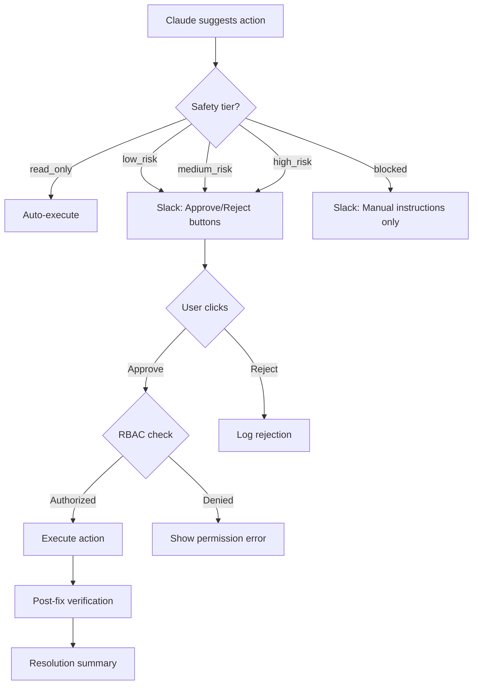

# Safety Model

Traced classifies every remediation action into a safety tier. No action is ever executed without human approval (except read-only operations).

## Safety Tiers

| Tier | Approval Required | Examples | Who Can Approve |
|------|------------------|----------|----------------|
| `read_only` | None | Gather more info, check status | Anyone (auto-approved) |
| `low_risk` | Quick confirm | Restart a pod, scale up replicas | Responder or Admin |
| `medium_risk` | Explicit approval | Rollback deployment, adjust resource limits | Responder (with confirmation) or Admin |
| `high_risk` | Admin approval | Drain node, edit ConfigMap, modify HPA | Admin only |
| `blocked` | Never automated | Delete namespace, modify RBAC, touch Secrets | Manual only — no buttons shown |

## How It Works

## RBAC Integration

Roles control who can approve which tiers:

| Role | `read_only` | `low_risk` | `medium_risk` | `high_risk` | `blocked` |
|------|:-----------:|:----------:|:--------------:|:-----------:|:---------:|
| Viewer | — | — | — | — | — |
| Responder | :white_check_mark: | :white_check_mark: | — | — | — |
| Admin | :white_check_mark: | :white_check_mark: | :white_check_mark: | :white_check_mark: | — |

See [RBAC Configuration](../configuration/rbac.md) for setup.

## Post-Fix Verification

After executing a remediation action, Traced automatically verifies the fix:

1. Waits for Kubernetes to reconcile (configurable, default 5-10s)
2. Checks pod health — no CrashLoopBackOff, no high restart counts
3. Checks for recent warning events
4. Posts a resolution summary to Slack with pass/fail status

If verification fails, the summary indicates "Issues remain" with details on what's still unhealthy.

## Design Principles

- **Human in the loop** — Every destructive action requires a human click
- **Blast radius awareness** — Claude reports what could go wrong for each action
- **Rollback guidance** — Every action includes how to undo it
- **Audit trail** — Every approval, rejection, and execution is persisted
- **Fail safe** — If anything goes wrong during execution, the action fails and the user is told to intervene manually
