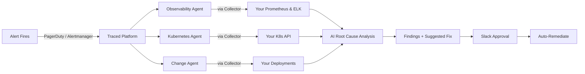

# Traced — AI SRE for Production Incidents

> From alert to root cause to fix, in minutes.

Traced is an AI-powered SRE platform that investigates production incidents automatically. When an alert fires, Traced dispatches specialist agents to query your metrics, logs, and cluster state in parallel, synthesizes a root cause, and suggests remediation actions with safety-tiered approval via Slack.

## How It Works

## What You Deploy

Only a **single lightweight component** — the Traced Collector — runs in your cluster. It acts as a read-only proxy to your Prometheus, Elasticsearch, and Kubernetes API. All AI processing happens on the Traced platform. Sensitive data is scrubbed before it leaves your cluster.

## Key Features

- **Multi-agent investigation** — Three specialist agents query metrics, logs, and cluster state in parallel
- **30-second investigations** — From alert to root cause with evidence chain and confidence score
- **Safety-first remediation** — Five-tier safety model; every action requires human approval in Slack
- **Data stays private** — Collector scrubs PII, tokens, and credentials before sending any data
- **Runbook-guided** — Built-in playbooks for OOM kills, latency spikes, CrashLoopBackOff, and more
- **Works with your stack** — Prometheus, Elasticsearch/OpenSearch, CloudWatch, any K8s distribution

## Quick Links

- [**Quick Start →**](getting-started/quickstart.md) Install the Collector in 3 steps
- [**Setup Guide →**](getting-started/setup-guide.md) Full production onboarding walkthrough
- [**How Investigations Work →**](getting-started/first-investigation.md) What happens when Traced investigates
- [**Architecture →**](architecture/overview.md) System design and data flow
- [**Security & Privacy →**](getting-started/setup-guide.md#11-security-data-privacy) What data leaves your cluster
