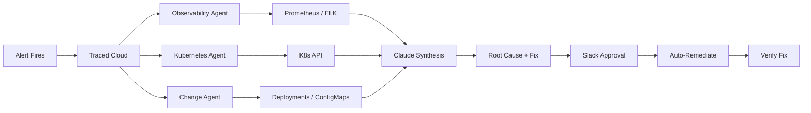

# Traced — AI SRE for Production Incidents

> From alert to root cause to fix, in minutes.

Traced is a multi-agent AI system that investigates production incidents automatically. When an alert fires, Traced dispatches specialist agents to query your observability stack in parallel, synthesizes a root cause using Claude, and suggests remediation actions with safety-tiered approval via Slack.

## How It Works

## Key Features

- **Multi-agent investigation** — Three specialist agents query metrics, logs, and cluster state in parallel
- **Runbook-guided** — Built-in playbooks for OOM kills, latency spikes, CrashLoopBackOff, and more
- **Safety-first remediation** — Five-tier safety model with human approval via Slack
- **Data stays internal** — The Collector runs in your cluster; sensitive data is scrubbed before leaving
- **Webhook ingestion** — PagerDuty, Alertmanager, and custom webhooks out of the box
- **Incident persistence** — Full audit trail with dashboard UI

## Quick Links

- [**Quick Start →**](getting-started/quickstart.md) Get running in 5 minutes with Docker Compose
- [**Setup Guide →**](getting-started/setup-guide.md) Full production setup for your cluster
- [**Architecture →**](architecture/overview.md) How the system works under the hood
- [**API Reference →**](api/webhooks.md) Webhook and REST API docs
